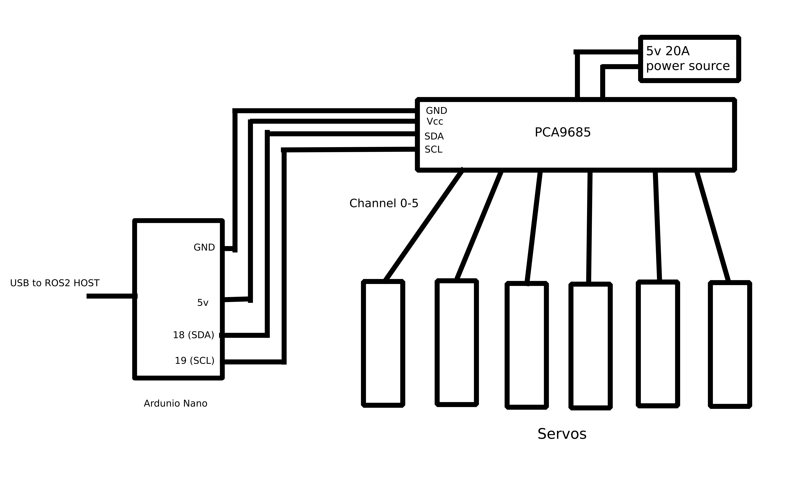

# 🤖 Robotics Arm Control

This package handles the **hardware interface and serial communication** for controlling a robotic arm using **ROS 2 Control**.  
It integrates the **Arduino firmware** (for joint actuation) and provides a **Python-based testing interface** with sliders for manual control.

---

## 📂 Project Structure

```
.
├── arm_controller.xml
├── CMakeLists.txt
├── firmware
│   ├── arm_base_code
│   │   └── arm_base_code.ino
│   └── serial_qt.py
├── include
│   └── robotics_arm_control
│       └── arm_control.hpp
├── package.xml
└── src
    └── arm_control.cpp
```

---

## ⚙️ Description

- **`arm_control.cpp / arm_control.hpp`** – Implements ROS 2 hardware interface for controlling servo motors via serial.
- **`arm_base_code.ino`** – Arduino firmware responsible for receiving commands and controlling servos.
- **`serial_qt.py`** – Python GUI tool with sliders for quick manual control and testing.
- **`arm_controller.xml`** – Controller configuration file for ROS 2 Control.

---

## 🧩 System Overview

Below is the schematic diagram showing how all components interact:



---

## 🧠 How It Works

1. **ROS 2 Node** sends joint commands via `hardware_interface`.
2. The **serial interface** transmits data to the **Arduino board**.
3. The **Arduino firmware** interprets commands and actuates the servos.
4. Optionally, **`serial_qt.py`** can manually control each joint using a GUI slider interface.

---

## 🚀 Usage

### Build

```bash
colcon build --packages-select robotics_arm_control
```

### Optional: Test via Python GUI

```bash
python3 firmware/serial_qt.py
```

---

🔗 **Project Repository:**  
[github.com/zimbot97/robotics_arm_pkg](https://github.com/zimbot97/robotics_arm_pkg)
